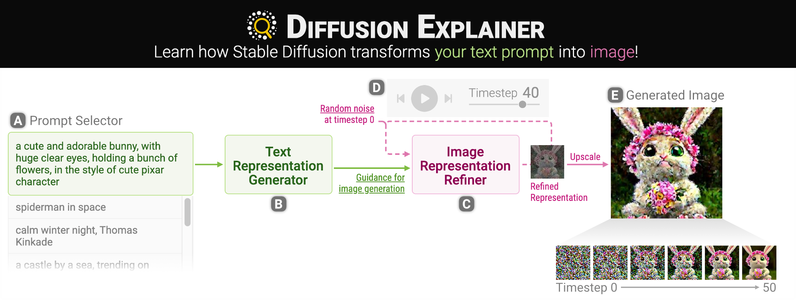

# Diffusion-Explainer
<!-- [](https://arxiv) -->

[](http://opensource.org/licenses/MIT)
[](https://arxiv.org/abs/2305.03509)

<ul>
  <li><a href="http://poloclub.github.io/diffusion-explainer">🚀 Live Demo</a></li>
  <li><a href="https://youtu.be/Zg4gxdIWDds">🎥 Demo Video</a></li>
  <li><a href="https://arxiv.org/abs/2305.03509">📜 Research Paper</a></li>
</ul>

# How to run locally
```
git clone https://github.com/poloclub/diffusion-explainer.git
cd diffusion-explainer
python -m http.server 8000
```

Then, on your web browser, access http://localhost:8000.
You can replace 8000 with other port numbers you want to use.

# Credits
Led by [Seongmin Lee](http://www.seongmin.xyz),
Diffusion Explainer is created by Machine Learning and Human-computer Interaction researchers at Georgia Tech and IBM Research.
The team includes
[Seongmin Lee](http://www.seongmin.xyz),
[Benjamin Hoover](https://bhoov.com),
[Hendrik Strobelt](http://hendrik.strobelt.com),
[Jay Wang](https://zijie.wang),
[ShengYun (Anthony) Peng](https://shengyun-peng.github.io),
[Austin Wright](https://www.austinpwright.com),
[Kevin Li](https://www.linkedin.com/in/kevinyli/),
[Haekyu Park](https://haekyu.github.io/),
[Alex Yang](https://alexanderyang.me/),
and [Polo Chau](http://www.cc.gatech.edu/~dchau/).

# License
The software is available under the [MIT License](https://github.com/poloclub/diffusion-explainer/blob/main/LICENSE).

# Contact
If you have any questions, feel free to [open an issue](https://github.com/poloclub/diffusion-explainer/issues/new/choose) or contact [Seongmin Lee](http://www.seongmin.xyz/).

<!-- # Citation
To learn more about Diffusion Explainer, please read our [paper](https:) and [demo video](https). Thanks!

```latex
``` -->
